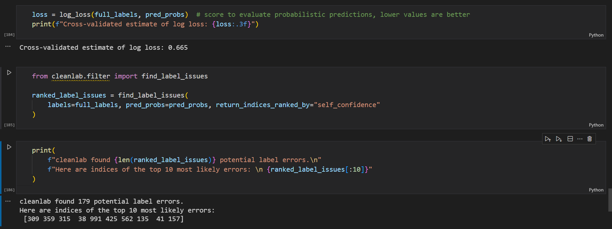

# AutomaticTest
## 综述

 [2-泵部-基于静态分析的警报识别的研究与优化.pdf](2-泵部-基于静态分析的警报识别的研究与优化.pdf) 

## 静态分析checkstyle

对源码 https://github.com/macrozheng/mall 进行checkstyle静态分析

分析结果汇总  [checkstyle.xlsx](checkstyle.xlsx) 

## 置信学习

数据集 [txt10.tar.gz](txt10.tar.gz) 

实现代码  [CL.ipynb](CL.ipynb) 

代码运行结果 

Cross-validated estimate of log loss: 0.665

cleanlab found 179 potential errors.

由此可见，置信学习的结果与我们使用checkstyle之后进行人工标记的结果大体一致。

谷歌colab	https://colab.research.google.com/

